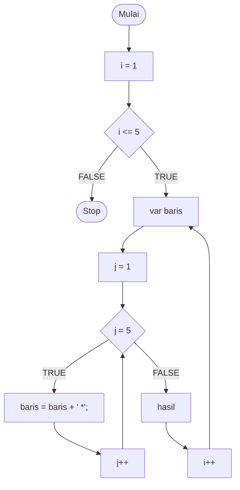
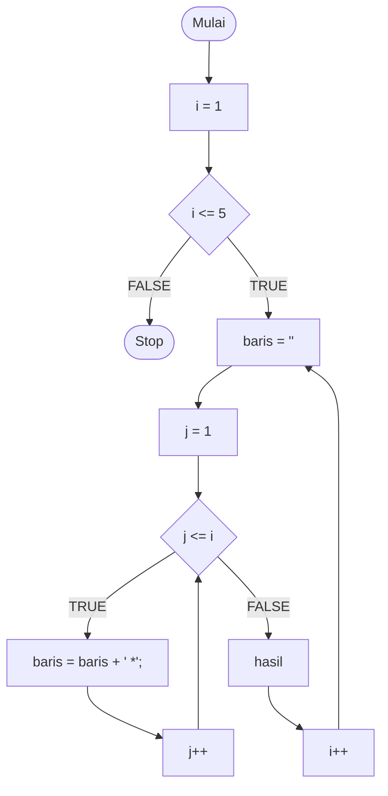

```mermaid
flowchart TD
    A([Mulai]) --> B[i = 1]
    B --> C{i <= 5}
    C --> |FALSE| Z([Stop])
    C --> |TRUE| D[var baris]
    D --> E[j = 1]
    E --> F{j = 5}
    F --> |TRUE| G[ baris = baris + ' *';]
    G --> H[j++]
    H --> F
    F --> |FALSE| J[hasil]
    J --> K[i++]
    K --> D
```

## Segitiga siku-siku

```mermaid
flowchart TD
    A([Mulai]) --> B[i = 1]
    B --> C{i <= 5}
    C --> |FALSE| Z([Stop])
    C --> |TRUE| D[baris = '']
    D --> E[j = 1]
    E --> F{j <= i}
    F --> |TRUE| G[ baris = baris + ' *';]
    G --> H[j++]
    H --> F
    F --> |FALSE| J[hasil]
    J --> K[i++]
    K --> D
```
